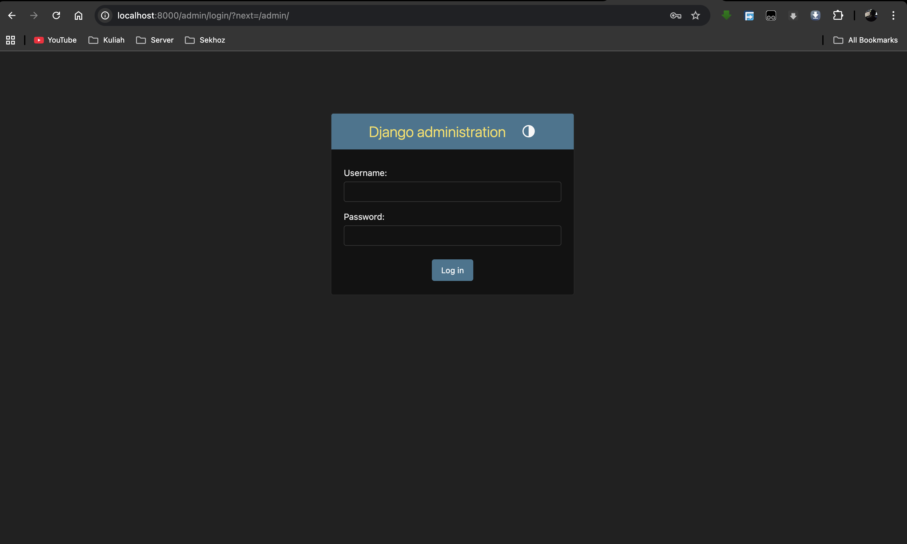
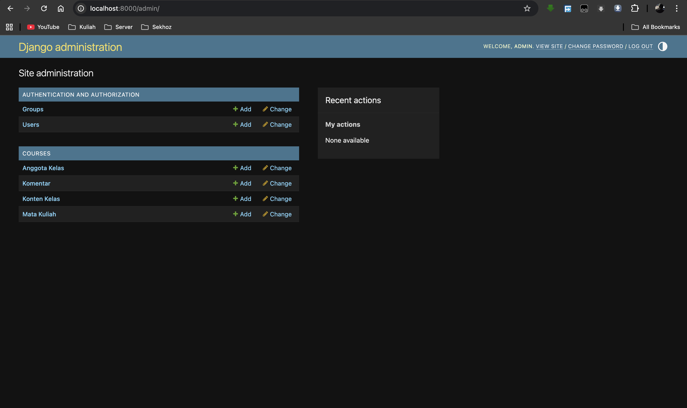
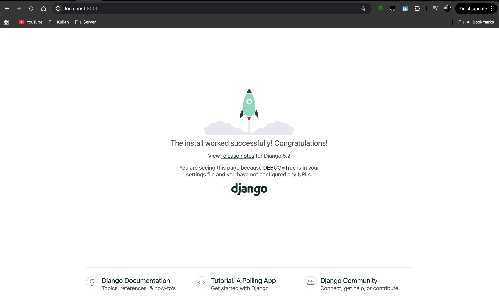

# 🚀 Simple LMS - Learning Management System

[](https://www.djangoproject.com/)
[](https://www.postgresql.org/)
[](https://www.docker.com/)
[](https://www.python.org/)

---

## 📋 Daftar Isi

| Tugas | Branch | Deskripsi |
|------|--------|-----------|
| **Tugas 1** | [main](https://github.com/PVegananda/simplelms/tree/main) | Setup Django & Docker Environment |
| **Tugas 2** | [Database-Design-&-ORM-Implementation](https://github.com/PVegananda/simplelms/tree/Database-Design-&-ORM-Implementation) | Database Design & Django ORM Implementation |

---

## 📚 Tentang Proyek

**Simple LMS** adalah implementasi Learning Management System berbasis **Django 6.0** dengan **PostgreSQL** yang dijalankan dalam **Docker Compose** multi-container.

### Tujuan Pembelajaran
- ✅ Setup Django dengan Docker
- ✅ Mengimplementasikan Django ORM & Models
- ✅ Migration dan database schema management
- ✅ CRUD operations dengan QuerySet API
- ✅ Relational queries & data aggregation
- ✅ Django Admin untuk data management

---

## 📌 TUGAS 2: Database Design & Django ORM Implementation

Branch ini fokus pada **implementasi model database dan ORM** untuk Simple LMS.

### Pembelajaran Inti
1. **Database Schema Design** - Membuat ERD (Entity Relationship Diagram) untuk Simple LMS
2. **Django Models** - Mendefinisikan model Course, CourseMember, CourseContent, Comment
3. **ORM Queries** - CRUD operations dan relational queries
4. **Data Management** - Mengimport data dari CSV ke database

### Fitur yang Diimplementasikan
- ✅ **4 Model Database** - Course, CourseMember, CourseContent, Comment
- ✅ **Relations** - Foreign Key dengan berbagai `on_delete` policy
- ✅ **Admin Interface** - Django Admin dengan custom ModelAdmin
- ✅ **Data Import** - Script Python untuk import data dari CSV
- ✅ **Query Examples** - CRUD dan relational query documentation

---

## 🧩 Tech Stack

* Docker & Docker Compose
* Django 6.0 (Python)
* PostgreSQL 15
* python-dotenv
* Pillow (Image handling)

---

## 🧱 Struktur Project

```
simple-lms/
├── docker-compose.yml           # Docker Compose configuration
├── Dockerfile                   # Django container image
├── requirements.txt             # Python dependencies
├── manage.py                    # Django CLI
│
├── config/                      # Project settings
│   ├── settings.py              # Django configuration
│   ├── urls.py                  # Main URL routing
│   ├── asgi.py                  # ASGI entry point
│   └── wsgi.py                  # WSGI entry point
│
├── courses/                     # Main app - LMS courses
│   ├── models.py                # Database models (ORM)
│   ├── views.py                 # View logic
│   ├── admin.py                 # Django Admin configuration
│   ├── apps.py                  # App configuration
│   └── migrations/              # Database migration files
│
├── fixtures/                    # Data files
│   ├── courses.csv              # Sample courses data
│   └── members.csv              # Sample members data
│
├── importer.py                  # CSV data import script
├── crud_operations.py           # CRUD query examples
│
└── query_relational_*.py        # Relational query examples
```

---

## 🚀 Quick Start

### 1. Setup Environment
```bash
cp .env.example .env
```

### 2. Build & Run Container
```bash
docker-compose up --build
```

### 3. Access Applications
- **Django App:** http://localhost:8000
- **Django Admin:** http://localhost:8000/admin/
- **PostgreSQL:** localhost:5432

### Admin Credentials
- **Username:** `admin`
- **Password:** `admin123456`
- **Email:** `admin@simplelms.com`

### Screenshots

#### Django Admin Login


#### Django Admin Dashboard


---

## 📖 STEP-by-STEP TUGAS 2

### STEP 1: Setup Models & Superuser ✅
Membuat database schema dengan Django Models dan superuser untuk admin access.

**Files:**
- `courses/models.py` - 4 models (Course, CourseMember, CourseContent, Comment)
- `courses/admin.py` - Admin customization dengan ModelAdmin
- Database migrations

**Commands:**
```bash
docker exec django_app python manage.py makemigrations
docker exec django_app python manage.py migrate
docker exec django_app python manage.py createsuperuser
```

---

### STEP 2: Import Data dari CSV ✅
Mengimport sample data dari file CSV ke database menggunakan custom script.

**Files:**
- `fixtures/courses.csv` - 5 courses data
- `fixtures/members.csv` - 14 course members data
- `importer.py` - Python script untuk automated import

**Data Imported:**
- 3 Teachers (dosen01, dosen02, dosen03)
- 10 Students (siswa01 - siswa10)
- 2 Assistants (asisten01, asisten02)
- 5 Courses
- 14 Course Members

**Command:**
```bash
docker exec django_app python importer.py
```

---

### STEP 3: Query CRUD Operations ✅
Dokumentasi dan contoh CRUD (Create, Read, Update, Delete) operations.

**Queries:**
- `crud_operations.py` - CREATE 2 courses baru
- `query_read.py` - READ/FILTER courses dengan harga > 40000
- `query_update.py` - UPDATE harga course dengan id=1
- `query_delete.py` - DELETE courses dengan harga < 30000

**Django Shell:**
```bash
docker exec django_app python manage.py shell
```

---

### STEP 4: Relational Queries ✅
Query yang melibatkan relationships antar model (ForeignKey, Reverse relation, Annotate).

**Queries:**
- `query_relational_1.py` - Tampilkan course dengan nama pengajar (ForeignKey access)
- `query_relational_2.py` - Tampilkan members di course tertentu (Reverse relation)
- `query_relational_3.py` - Hitung members per course (Annotate)
- `query_relational_4.py` - Top 3 courses dengan member terbanyak (Order + Annotate)
```

Keuntungan:

* Data tidak hilang saat container restart
* Konsisten untuk development

---

## 🔗 Arsitektur Sistem

```id="r3k9wb"
Browser → Django Container → PostgreSQL Container
```

---

## ⚠️ Catatan Penting

* Service `web` menggunakan `depends_on` untuk memastikan database dijalankan terlebih dahulu
* Delay (`sleep`) digunakan agar PostgreSQL siap sebelum Django melakukan koneksi
* Konfigurasi database menggunakan environment variables

---

## 📸 Screenshot

### 🔹 Django Running



---

## Jawaban Pertanyaan

### 1. Kenapa perlu volume untuk PostgreSQL?

Agar data tetap tersimpan meskipun container dihentikan atau dihapus.

---

### 2. Apa fungsi depends_on?

Untuk memastikan container database dijalankan sebelum aplikasi.

---

### 3. Bagaimana Django connect ke PostgreSQL?

Menggunakan konfigurasi environment variables yang dibaca di `settings.py`.

---

### 4. Apa keuntungan menggunakan PostgreSQL?

Lebih stabil, scalable, dan cocok untuk aplikasi backend dibanding SQLite.

---

---

## 🗄️ Database Schema

### Entity Relationship Diagram (ERD)

```
USER (Django built-in)
├─ teaches → COURSE (1:Many)
└─ enrolled_in → COURSE_MEMBER (1:Many)

COURSE
├─ taught_by → USER (Many:1)
├─ has_members → COURSE_MEMBER (1:Many)
└─ has_content → COURSE_CONTENT (1:Many)

COURSE_MEMBER
├─ in_course → COURSE (Many:1)
├─ is_user → USER (Many:1)
└─ writes_comments → COMMENT (1:Many)

COURSE_CONTENT
├─ in_course → COURSE (Many:1)
├─ parent_content → COURSE_CONTENT (Self, nullable)
└─ has_comments → COMMENT (1:Many)

COMMENT
├─ on_content → COURSE_CONTENT (Many:1)
└─ by_member → COURSE_MEMBER (Many:1)
```

### Models Overview

| Model | Purpose | Key Fields |
|-------|---------|-----------|
| **Course** | Mata kuliah/courses | name, description, price, teacher, image |
| **CourseMember** | Pendaftaran siswa | course_id, user_id, roles (std/ast) |
| **CourseContent** | Konten/materi kelas | name, description, video_url, file_attachment, parent_id |
| **Comment** | Komentar pada konten | content_id, member_id, comment |

---

## 📚 Model Field Reference

### Field Types
- `CharField` - String pendek dengan max_length
- `TextField` - Text panjang tanpa batas
- `IntegerField` - Bilangan bulat
- `DateTimeField` - Tanggal dan waktu
- `ImageField` - Upload gambar (requires Pillow)
- `FileField` - Upload file
- `ForeignKey` - Relasi many-to-one ke model lain

### Common Field Options
| Option | Description |
|--------|-------------|
| `max_length` | Panjang maksimum (untuk CharField) |
| `null=True` | Kolom boleh NULL di database |
| `blank=True` | Field boleh kosong di form |
| `default` | Nilai default |
| `choices` | Batasi nilai yang valid |
| `auto_now_add=True` | Auto-populate saat create |
| `auto_now=True` | Auto-update setiap save |

### on_delete Behaviors
| Option | Behavior |
|--------|----------|
| `CASCADE` | Hapus semua relasi saat parent dihapus |
| `RESTRICT` | Cegah penghapusan jika ada relasi |
| `PROTECT` | Raise error jika ada relasi |
| `SET_NULL` | Set ke NULL (perlu null=True) |

---

## 🔗 Useful Commands

```bash
# Enter Django shell untuk test queries
docker exec -it django_app python manage.py shell

# Create migrations dari model changes
docker exec django_app python manage.py makemigrations

# Apply migrations ke database
docker exec django_app python manage.py migrate

# Show migration status
docker exec django_app python manage.py showmigrations

# System health check
docker exec django_app python manage.py check

# Import data dari CSV
docker exec django_app python importer.py

# View container logs
docker logs django_app -f

# Run queries script
docker exec django_app python query_read.py
docker exec django_app python query_relational_1.py

# Stop all containers
docker-compose down

# Remove containers dan volumes
docker-compose down -v
```

---

## 📖 Learning Resources

- [Django ORM Documentation](https://docs.djangoproject.com/en/6.0/topics/db/models/)
- [Django QuerySet API Reference](https://docs.djangoproject.com/en/6.0/ref/models/querysets/)
- [Django Admin Documentation](https://docs.djangoproject.com/en/6.0/ref/contrib/admin/)
- [Django Migrations Guide](https://docs.djangoproject.com/en/6.0/topics/migrations/)
- [ForeignKey on_delete Behaviors](https://docs.djangoproject.com/en/6.0/ref/models/fields/#django.db.models.ForeignKey.on_delete)

---

## ✅ Implementation Status

| Component | Status | Progress |
|-----------|--------|----------|
| STEP 1: Setup Models | ✅ Complete | Models + Admin + Migrations |
| STEP 2: Data Import | ✅ Complete | CSV import script working |
| STEP 3: CRUD Queries | ✅ Complete | Create, Read, Update, Delete |
| STEP 4: Relational Queries | ✅ Complete | Foreign Key, Reverse, Annotate |
| Django Admin | ✅ Working | All models registered |
| PostgreSQL | ✅ Connected | Data persisted in volume |

---

## 📝 Notes

- Semua model sudah ter-register di Django Admin dengan custom ModelAdmin
- Database menggunakan PostgreSQL 15 dalam container Docker
- Data sample dapat di-import ulang tanpa duplikasi (menggunakan `get_or_create`)
- Password user tersimpan aman dengan hashing di database
- Total 12 commits untuk semua STEP (1 file = 1 commit)

---

## 👤 Author

**Pasyah Vegananda**

**Related Branches:**
- [main](https://github.com/PVegananda/simplelms/tree/main) - TUGAS 1: Setup Django & Docker
- [Database-Design-&-ORM-Implementation](https://github.com/PVegananda/simplelms/tree/Database-Design-&-ORM-Implementation) - TUGAS 2: Database & ORM 

---

## Status

✔️ Docker Compose berjalan
✔️ Django berjalan di container
✔️ PostgreSQL terhubung
✔️ Semua models ter-migrate
✔️ Admin interface working
✔️ CSV data imported
✔️ CRUD queries documented
✔️ Relational queries working
